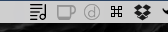
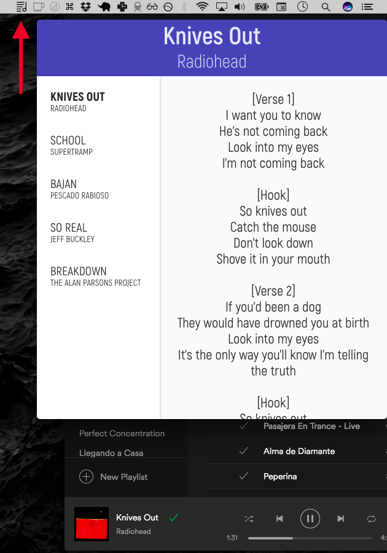
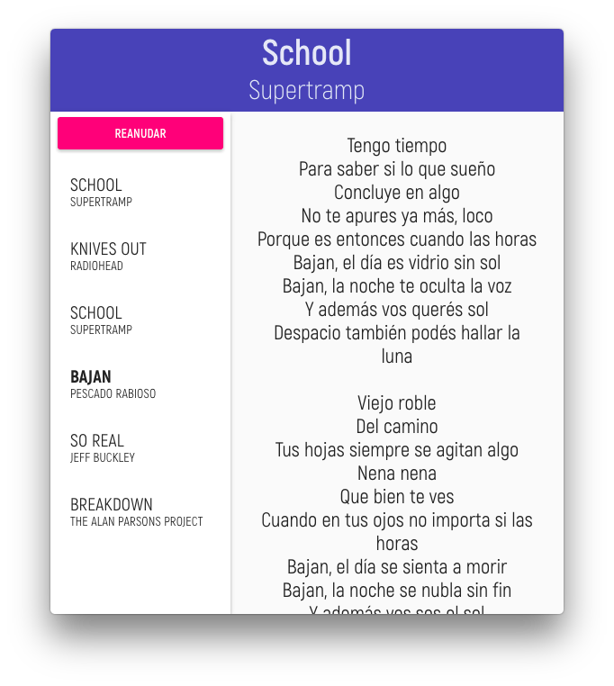

# Letra for Mac

**Shows the lyrics of current playing track in Spotify (macOS)**

## Download

- [Latest Release](https://github.com/ycanales/letra/releases/tag/v1.0.0)

## Screenshots
### Menubar icon

### Currently playing track

### Previously played track, auto-update paused

## Coming soon

- ~~Auto-update current playing song~~
- Annotations
- Support for more OSes
- Support for more players

Powered by [Electron](http://electron.atom.io)
